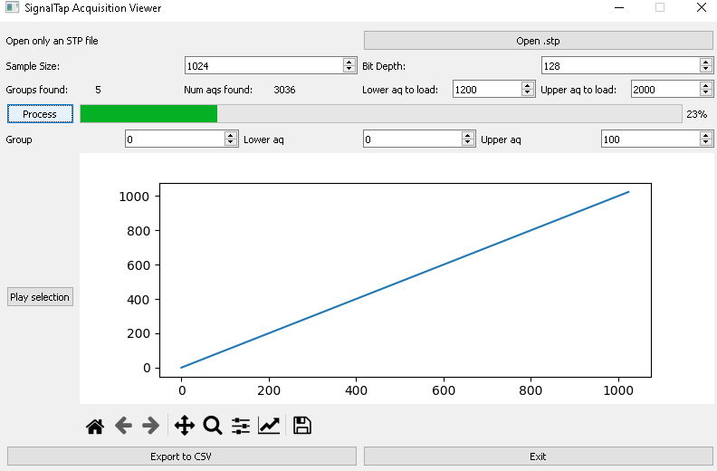

signaltap_extractor
========

### Python script to extract Quartus II SignalTap acquisitions from .stp files

## Motivation

----

[SignalTap](https://www.intel.com/content/www/us/en/docs/programmable/683819/21-3/logic-analyzer-introduction.html)
 for Quartus II is a powerful FPGA debugging tool, allowing real-time signal behaviour to be examined.

When working with real signals, you can view then as signed or unsigned line plots directly in the tool - neat!

You can even export a single acquisition as a csv (somewhat clumsily) to view offline. But only a **single** acquisition.

This tool lets you export as many acquisitions from the associated .stp file as your PC memory allows to a CSV file.

Then you can view / process offline in a language of your choice.

## Usage

----

This program is used from the top-down i.e:

- Load in your .stp file
- Set the number of samples / acquisition and overall bit depth of your SignalTap instance
- Choose an upper and lower acquisition number to load in
	-	As previously stated "... as your PC memory allows"
- Hit process & wait
- Tell the plot which group, upper and lower acquisition you'd like to view and export
- Play selection to view your chosen range
- Export to CSV

## Prerequisites & dependencies

----

- An .stp file with data sorted into groups
- Python3
- Numpy
- Matplotlib
- PyQT5

## Be Warned!

----

I am not a Python or QT expert and this code is buggy!

I trust that if you're using this tool then you can diagnose issues yourself.

## License

----

> You can check out the full license [here](LICENSE)

This project is licensed under the terms of the **MIT** license.

